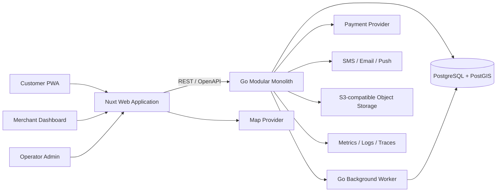
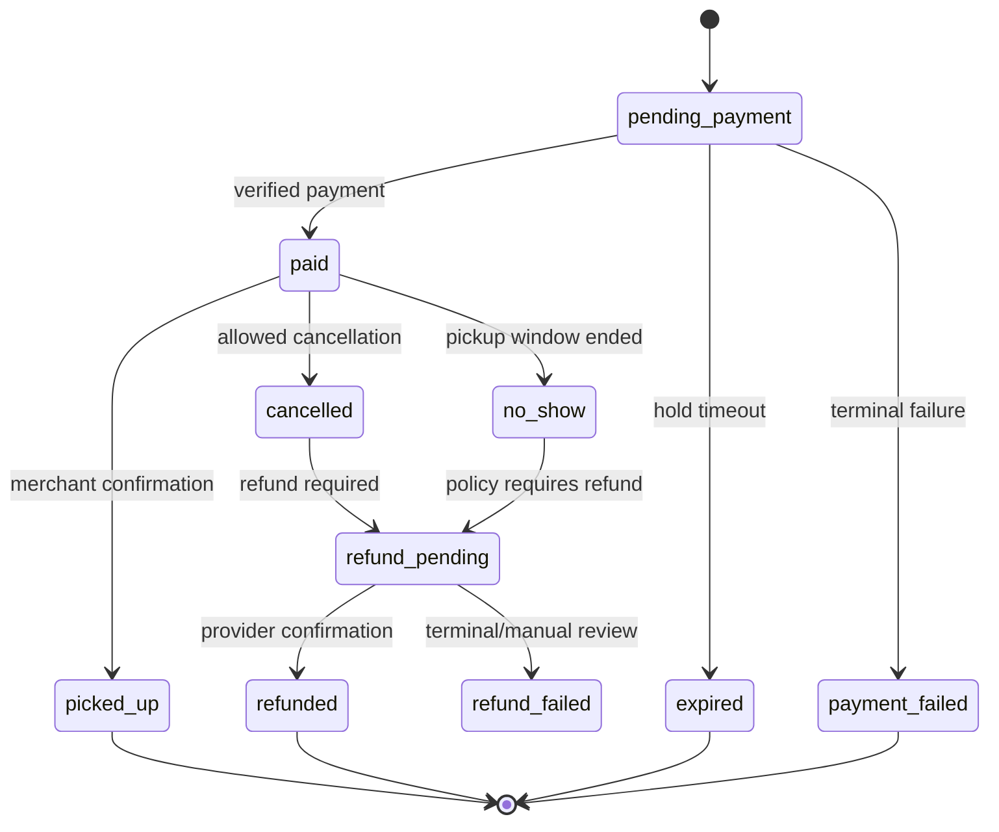

# Food Rescue Marketplace for Russia — Product and Engineering Plan

> Living plan shared by the founder/product owner and Codex.  
> Last reviewed: 2026-08-21  
> Status: Customer frontend prototype implemented; backend not started  
> Working product name: ЕщёЕсть (provisional)

## Quick navigation

- [Collaboration model](#2-collaboration-model)
- [Executive summary and stack](#3-executive-summary)
- [Current frontend implementation](#current-pet-project-implementation-2026-08-21)
- [MVP scope](#7-scope)
- [Architecture](#9-architecture)
- [Data model](#11-data-model)
- [State models](#12-state-models)
- [Security](#15-authentication-authorization-and-security)
- [Russian legal and compliance gates](#16-russia-specific-legal-and-compliance-work)
- [Metrics and pilot gates](#21-analytics-and-metrics)
- [Delivery roadmap](#26-delivery-roadmap)
- [Release checklist](#27-release-checklist)
- [Risk register](#28-risk-register)
- [Open decisions](#31-open-decisions)
- [Immediate next actions](#32-immediate-next-actions)

## 1. Purpose of this document

This document is the source of truth for building a Russian-market food-rescue marketplace inspired by the business model of Too Good To Go, without copying its name, branding, copyrighted assets, text, or exact interface.

It defines:

- The initial product and business assumptions.
- What is and is not part of the MVP.
- The proposed technical architecture and tools.
- The key data model, API, security, and operational requirements.
- Russia-specific payment, privacy, consumer, food-safety, and platform-law work.
- A phased delivery plan with responsibilities and exit criteria.
- Pilot metrics, risks, decision gates, and launch checklists.

This is a living document. When an important decision changes, update the relevant section and add an entry to the decision log.

## 2. Collaboration model

### Roles

**Founder / product owner — You**

- Own the product vision, company formation, budget, and final decisions.
- Choose the launch city and merchant segment.
- Conduct or arrange customer and merchant interviews.
- Engage Russian legal and accounting specialists.
- Open and control accounts with payment, SMS, maps, hosting, and other providers.
- Approve user experience, commercial terms, legal documents, and production releases.
- Recruit merchants and operate the initial marketplace.

**Engineering collaborator — Codex / Me**

- Convert approved requirements into technical designs and implementation tasks.
- Scaffold and implement the application in the shared repository.
- Create database migrations, API contracts, frontend views, tests, and documentation.
- Review code, diagnose failures, improve security, and automate repeatable work.
- Keep this plan, architecture notes, and implementation status aligned with the repository.
- Clearly flag decisions that require business, legal, financial, or external authority.

**Shared responsibilities — Both**

- Prioritize scope and maintain the backlog.
- Review each phase against its exit criteria.
- Test the product from customer, merchant, and operator perspectives.
- Review pilot data and decide whether to iterate, scale, or stop.

### Working rules

1. Business and legal assumptions must not be silently converted into code.
2. Payment, fiscalization, seller-of-record, privacy, and food-safety decisions are release gates.
3. Every feature should have acceptance criteria before implementation.
4. Production changes require tests proportional to risk and a rollback approach.
5. Secrets, production customer data, and provider credentials must never be committed to Git.
6. The MVP favors a small, reliable system over infrastructure intended for hypothetical scale.

### Task notation

- `[You]` — founder/product work or an external action only the founder can authorize.
- `[Me]` — repository, design, engineering, test, or documentation work Codex can perform.
- `[Both]` — a joint review or decision.
- `[Legal]` — requires confirmation from qualified Russian counsel/accounting specialists.

## 3. Executive summary

### Product hypothesis

Food retailers, bakeries, cafes, restaurants, hotels, and grocers regularly have safe food that is unlikely to sell before its sale window ends. Customers are willing to collect a discounted surprise pack during a defined pickup window. A marketplace can connect the two sides, reduce waste, generate incremental merchant revenue, and give customers affordable food.

### Initial operating model

- Launch in one compact, dense geographic area rather than nationwide.
- Pickup only; no delivery in the MVP.
- Merchants publish a quantity of discounted surprise packs.
- Customers discover nearby packs, prepay, and receive a pickup code.
- Merchants confirm pickup; the platform records completion, cancellation, refund, or no-show.
- The legal seller and fiscal receipt model must be confirmed before payment implementation.

### Recommended stack

**Nuxt 4 / Vue 3 / TypeScript + Go modular monolith + PostgreSQL/PostGIS**

Overall rating: **9/10**, assuming the team is comfortable with Go.

| Area | Choice | Rating | Reason |
|---|---|---:|---|
| Customer and business web apps | Nuxt 4, Vue 3, TypeScript | 9.5/10 | Routing, SSR, SEO, PWA support, good developer experience |
| API and workers | Go | 9/10 | Explicit behavior, strong concurrency, good payment and job processing |
| Primary database | PostgreSQL | 10/10 | Transactions, constraints, reporting, mature operational tooling |
| Location queries | PostGIS | 10/10 | Radius, distance, bounding-box, and spatial-index queries |
| Initial architecture | Modular monolith | 10/10 for MVP | Fast to build and operate while preserving domain boundaries |

If a solo developer is new to Go, full-stack Nuxt could deliver an experiment faster. The selected split is preferable when Go skills are available or the system is intended to become a serious marketplace.

### Current pet-project implementation — 2026-08-21

The first customer-web prototype now exists in `apps/web`. Legal and production-provider decisions are deferred while the project remains a local pet project; the corresponding gates in this plan still apply before accepting real users, personal data, or payments.

Implemented routes and states:

- `/` — separate guest landing page and authenticated customer dashboard.
- `/login` — passwordless two-step email-code flow backed by PostgreSQL sessions.
- `/register` — name/email registration with six-digit email verification.
- `/discover` — nearby discovery with a responsive illustrative map/list view, radius and category controls.
- `/browse` — searchable, sortable, filterable offer catalog.
- `/offers/[id]` — offer detail and reservation interaction prototype.
- `/delivery` — authenticated order/pickup screen plus a clearly marked future delivery concept; courier logistics remain outside MVP scope.
- `/profile` — authenticated profile, impact, favorites, notifications, and logout.

Current technical boundaries:

- Nuxt 4, Vue 3, TypeScript, and SSR are configured under `apps/web`.
- Authentication and profile edits use the Go API, PostgreSQL, and an HttpOnly session cookie; favorites still use a browser cookie.
- Offers, merchants, location, inventory, and the active order use typed mock data.
- Original local food imagery is stored in `apps/web/public/images`; no external runtime image dependency is required.
- The frontend has a multi-stage, non-root Docker image and a standalone Compose service for VPS previews.
- The Go API in `apps/api` has embedded migrations, email-code auth, profile endpoints, initial offer CRUD, OpenAPI, and a non-root Docker image.
- Nuxt proxies `/api/*` to the Go service so browsers never need a separate API origin or public API port.
- `npm run typecheck` and `npm run build` pass.

Next frontend integration work:

1. Replace the offer, favorite, reservation, and order mock repositories behind composables using the new OpenAPI boundary.
2. Connect a sandbox map/geocoding provider and real device geolocation.
3. Add component and end-to-end tests for guest, auth, browse, favorite, reservation, and pickup journeys.
4. Add loading, empty, offline, API-error, email-code throttling, and expired-offer states.
5. Add the PWA manifest/service worker after the core API boundary is stable.

## 4. Product principles

1. **Safety before sell-through.** Expired or unsafe food must never be listed or sold.
2. **Density before geography.** A small useful marketplace beats a large empty map.
3. **Merchant workflow must be extremely fast.** Publishing today’s surplus should take roughly a minute after setup.
4. **Prepayment protects supply.** It reduces casual reservations and makes pickup intent measurable.
5. **Clear expectations prevent support cases.** Surprise contents, pickup window, cancellation rules, seller identity, and possible allergens must be communicated plainly.
6. **PostgreSQL is the source of truth.** Inventory, orders, money, and status transitions must not depend on a cache.
7. **Operations are part of the product.** Merchant onboarding, moderation, refunds, and support need tools from the first pilot.
8. **Collect the minimum personal data.** Every personal field needs a defined purpose and retention rule.

## 5. Target users and jobs to be done

### Customer

Potential early customer segments:

- Price-conscious students and young professionals.
- People living or working near dense food-retail clusters.
- Environmentally motivated customers.
- Customers comfortable with variable or surprise contents.

Core job:

> “Help me find good-value food near me that I can reliably collect at a convenient time.”

Customer success conditions:

- Nearby supply is visible immediately.
- The total price and pickup window are unambiguous.
- Payment is fast and trustworthy.
- Pickup requires little explanation at the outlet.
- A failed pickup or cancellation has a clear resolution path.

### Merchant owner or manager

Potential initial categories:

- Bakeries and pastry shops.
- Cafes and coffee shops.
- Ready-meal counters.
- Small grocery and specialty-food stores.
- Hotel breakfast or buffet operations, after legal and operational validation.

Core job:

> “Help me turn unpredictable daily surplus into incremental revenue without adding significant staff work.”

Merchant success conditions:

- Onboarding and legal verification are clear.
- Offers can be created from reusable templates.
- Quantity can be changed in seconds.
- Staff can validate pickup using a short code or QR scan.
- Payout, commission, refund, and order reports are understandable.

### Merchant counter staff

Core job:

> “Tell me quickly whether this customer has a valid paid order and let me complete it.”

### Platform operator and support agent

Core job:

> “Give me enough evidence and control to keep listings safe, resolve incidents, and understand marketplace health.”

## 6. Discovery assumptions to validate

These are hypotheses, not established facts.

| Hypothesis | Validation method | Pass signal |
|---|---|---|
| Merchants have recurring surplus at least several days per week | 20–30 structured merchant interviews | At least 10 credible pilot candidates with recurring supply |
| Staff can support a defined pickup window | Shadow merchant closing workflow | A repeatable workflow with minimal staff training |
| Customers accept surprise contents | Landing page, interviews, manual pilot | Reservation intent and acceptable complaint rate |
| Online prepayment is acceptable | Prototype checkout and pilot | Most intended users complete payment |
| One compact area can support useful density | Supply map and customer travel analysis | Multiple offers within practical travel distance |
| Unit economics can cover payment, messaging, support, refunds, tax, and hosting | Per-order financial model | Positive contribution margin at a realistic commission |
| Merchant reporting is sufficient without POS integration | Manual pilot | Merchants can reconcile orders from platform reports |

### Discovery interview topics

Merchant interviews should cover:

- Surplus categories, quantity, value, and frequency.
- When surplus becomes predictable.
- Current disposal or discount process.
- Food-safety, labeling, storage, and expiration controls.
- Staff available during pickup.
- Preferred payout and reporting model.
- Willingness to pay commission and acceptable operational burden.
- Existing POS, inventory, and fiscal systems.
- Who has authority to sign a marketplace agreement.

Customer interviews should cover:

- Typical food-shopping radius and pickup times.
- Reaction to unknown exact contents.
- Dietary and allergen concerns.
- Expected discount versus perceived risk.
- Preferred map/list discovery behavior.
- Payment, cancellation, refund, and notification expectations.

## 7. Scope

### MVP must have

#### Customer experience

- Russian-language responsive PWA.
- Passwordless email authentication with a short-lived six-digit verification code.
- Permission-based location or manually selected area.
- Nearby offer list and map.
- Search and basic filters.
- Outlet and offer details.
- Pickup window, original value, current price, seller details, and safety information.
- Online prepayment.
- Paid order screen with one-time pickup code.
- Order history and current status.
- Cancellation/refund request under defined rules.
- Basic support contact and incident category.
- Transactional notifications.

#### Merchant experience

- Merchant and legal-profile onboarding.
- One or more outlets.
- Staff memberships and roles.
- Outlet hours and pickup instructions.
- Reusable offer templates.
- Create, publish, pause, and end an offer.
- Set price, quantity, pickup window, publication time, and safe sale cutoff.
- View active and historical orders.
- Validate pickup code and mark no-show where permitted.
- Simple daily and weekly reports.

#### Operator experience

- Merchant verification queue.
- Outlet and offer moderation.
- Customer, merchant, order, payment, and refund search.
- Manual cancellation and refund controls with reasons.
- Offer shutdown and merchant suspension.
- Readable order event timeline.
- Audit history for privileged actions.
- Core marketplace dashboard.

#### Platform capabilities

- Idempotent payment creation and webhook processing.
- Transactional stock reservation.
- Expired reservation release.
- Automatic offer closure at safe cutoff.
- Outbox-based event delivery.
- Consent and legal-document version history.
- Centralized structured logs and metrics.
- Backups and tested restoration.

### Explicitly out of scope for MVP

- Delivery or courier logistics.
- Native iOS and Android applications.
- Multi-city operations.
- Automated POS or ERP integrations.
- Machine-learning recommendations.
- Dynamic pricing algorithms.
- Loyalty points, gamification, or complex referrals.
- Customer-to-customer resale.
- Social feed or public comments.
- Multi-merchant shopping cart.
- Subscriptions.
- Kafka, Kubernetes, service mesh, or microservices.
- Automated merchant payouts before the legal/payment model is stable.

## 8. Core user journeys and acceptance criteria

### Journey A — Discover and buy

1. Customer opens the PWA.
2. Customer grants location permission or selects an area.
3. System returns available offers ordered by a defined combination of distance and pickup time.
4. Customer opens an offer and sees all required information.
5. Customer authenticates if necessary.
6. System temporarily reserves one unit.
7. Customer pays.
8. Verified payment changes the order to paid.
9. Customer receives a pickup code and notification.

Acceptance criteria:

- Only published, safe, in-stock offers with an active sale window appear.
- Distance is calculated by PostGIS, not by trusting client data.
- The last available unit cannot be sold twice under concurrent requests.
- Repeating a checkout request cannot create multiple paid orders.
- Browser redirects cannot independently mark an order paid.
- Duplicate or out-of-order payment webhooks are safe.
- All displayed money is derived from integer kopeck values.

### Journey B — Merchant publishes surplus

1. Authorized merchant staff selects an offer template.
2. Staff sets quantity, price, pickup window, and safe sale cutoff.
3. Server validates outlet status and safety constraints.
4. Offer becomes visible at its publication time.
5. Staff can decrease remaining unsold quantity or pause the offer.

Acceptance criteria:

- Unauthorized users cannot modify another merchant or outlet.
- Pickup end cannot exceed the approved safe sale cutoff.
- Published quantity cannot be negative.
- Quantity reductions cannot invalidate already paid orders.
- Every publish, pause, price, quantity, and cutoff change is auditable.

### Journey C — Pickup

1. Customer presents the code or QR token.
2. Merchant staff opens the pickup view.
3. Server validates the token, outlet, status, and pickup window.
4. Merchant confirms handoff.
5. Order changes to picked up and the event is recorded.

Acceptance criteria:

- Tokens are random, short-lived where appropriate, and safe from enumeration.
- A pickup can be confirmed only once.
- Staff receives a clear response for expired, refunded, cancelled, or already used orders.
- Support can inspect who confirmed pickup and when.

### Journey D — Cancellation and refund

1. Cancellation is initiated by customer, merchant, system, or support.
2. Policy engine determines whether automatic cancellation is allowed.
3. Inventory is released only if it can still be safely sold.
4. Payment refund is created when required.
5. Webhook or provider verification confirms the final refund state.

Acceptance criteria:

- Refund requests are idempotent.
- Partial and full refund capability is modeled even if MVP permits only full refunds.
- Financial and order state changes are separate but coordinated.
- Support can see the policy and reason that produced the outcome.

## 9. Architecture



### Architecture rules

- One deployable Go API and one Go worker may share a repository and domain packages.
- One PostgreSQL database is authoritative for transactional state.
- Domain modules communicate through explicit application interfaces and recorded events.
- Provider-specific payment, SMS, maps, and storage logic stays behind adapters.
- Background effects begin from a transactional outbox so database commits and event delivery cannot silently diverge.
- Redis is optional and must not own inventory, payment, or order truth.
- Introduce a new service only after measured scaling or isolation requirements justify it.

### Proposed repository structure

```text
/
├── apps/
│   ├── web/                    # Nuxt 4 application
│   └── api/
│       ├── cmd/
│       │   ├── api/            # HTTP server entrypoint
│       │   └── worker/         # Background worker entrypoint
│       └── internal/
│           ├── account/
│           ├── merchant/
│           ├── catalog/
│           ├── order/
│           ├── payment/
│           ├── pickup/
│           ├── notification/
│           ├── admin/
│           └── platform/
├── api/
│   └── openapi.yaml
├── db/
│   ├── migrations/
│   ├── queries/
│   └── seeds/
├── deploy/
│   ├── docker/
│   └── environments/
├── docs/
├── scripts/
├── .env.example
├── docker-compose.yml
└── PLAN.md
```

### Domain modules

| Module | Owns | Does not own |
|---|---|---|
| Account | Users, sessions, OTP, roles | Merchant legal identity |
| Merchant | Merchants, outlets, staff, verification | Offer inventory |
| Catalog | Templates, offers, availability windows | Payments |
| Order | Reservations, order state, price snapshot | Provider credentials |
| Payment | Payment attempts, webhook inbox, refunds | Business inventory |
| Pickup | Pickup token and confirmation | Payment settlement |
| Notification | Templates, preferences, deliveries | Source transaction state |
| Admin | Moderation commands and views | Hidden mutation of domain tables |
| Platform | Config, audit, legal docs, outbox | Business-domain rules |

## 10. Technology choices

### Web

- Nuxt 4 and Vue 3.
- TypeScript with strict mode.
- `pnpm` for JavaScript package management.
- Tailwind CSS and a deliberately small internal UI layer.
- Pinia only for cross-route client state that cannot remain server-derived.
- Nuxt server rendering or hybrid rendering for public outlet/offer pages.
- PWA manifest, installability, offline shell, and safe retry behavior.
- Vitest and Vue Test Utils.
- Playwright for end-to-end browser flows.

### API and jobs

- Current stable Go toolchain.
- Standard `net/http` or `chi` for HTTP routing.
- `pgx` for PostgreSQL access.
- `sqlc` for generated type-safe query code.
- `goose` for ordered database migrations.
- OpenAPI 3.x as the client/server contract.
- Structured logging using Go's standard `slog` or an equivalent adapter.
- Background job claiming through PostgreSQL with explicit retries and dead-letter state.

### Database

- PostgreSQL with PostGIS enabled.
- `geography(Point, 4326)` for outlet position.
- GiST spatial index for nearby queries.
- `timestamptz` for instants; store an IANA timezone on each outlet.
- Integer kopecks in `bigint` for money.
- UUID identifiers exposed publicly.
- Check constraints for quantities, time windows, and money.
- Unique constraints for idempotency keys and external provider event IDs.

### External services

- ЮKassa as the initial payment candidate.
- Yandex Maps as the initial map/geocoding candidate.
- Replaceable transactional email/SMTP provider for passwordless verification.
- S3-compatible object storage hosted in an appropriate Russian region.
- Web Push and email for transactional notifications.
- Telegram notification bot only as a later opt-in channel.

### Observability

- OpenTelemetry instrumentation.
- Prometheus metrics.
- Grafana dashboards and alerting.
- Loki-compatible centralized logs.
- Error reporting hosted or configured so personal data is not transferred unlawfully.
- Provider request correlation IDs without logging secrets or full payloads containing personal data.

## 11. Data model

The exact schema will be defined through migrations. The following entities establish the required shape.

### Identity and access

| Table | Important fields |
|---|---|
| `users` | `id`, normalized unique `email`, display name, city, role, verification and created/updated times |
| `user_profiles` | `user_id`, optional display data, locale |
| `user_sessions` | `id`, `user_id`, token hash, device metadata, expiry, revoked time |
| `email_challenges` | normalized email, purpose, code hash, attempt count, expiry, consumed time |
| `roles` / `permissions` | stable role and permission definitions |
| `merchant_memberships` | user, merchant, outlet scope, role, status |

### Merchant and outlet

| Table | Important fields |
|---|---|
| `merchants` | `id`, display name, status, verification status |
| `merchant_legal_profiles` | legal name, entity type, INN/OGRN fields, address, contract version/status |
| `outlets` | merchant, name, address, PostGIS point, timezone, status, contact details |
| `outlet_hours` | outlet, weekday/date exception, open/close times |
| `outlet_images` | object key, ordering, moderation state |
| `merchant_verification_events` | actor, check type, result, evidence reference, timestamp |

### Offers and inventory

| Table | Important fields |
|---|---|
| `offer_templates` | merchant/outlet, title, category, description, expected value, allergen/storage disclosures |
| `offers` | template/outlet, price, original value, publish time, sale cutoff, pickup start/end, status |
| `offer_inventory` | offer, initial quantity, reserved quantity, sold quantity, picked-up quantity, version |
| `offer_events` | actor, event type, old/new values, reason, timestamp |

The initial implementation may simplify inventory to an `available_quantity` updated atomically. Counters must remain reconcilable from orders and events.

### Orders and pickup

| Table | Important fields |
|---|---|
| `orders` | user, merchant, outlet, offer, state, quantity, price snapshot, seller snapshot, hold expiry |
| `order_events` | order, state/event, actor type/id, metadata, timestamp |
| `pickup_tokens` | order, token hash, valid window, used time, confirming staff |
| `cancellation_requests` | initiator, reason, policy result, resolution |

Store a legal/seller and offer snapshot on the order so later merchant edits do not alter the historical transaction record.

### Payments and financial records

| Table | Important fields |
|---|---|
| `payment_attempts` | order, provider, external ID, idempotency key, amount, state, confirmation data |
| `payment_events_inbox` | provider event ID, payload reference/hash, received/processed state |
| `refunds` | payment/order, amount, reason, provider ID, state |
| `commission_records` | order, calculation basis, rate, amount, version |
| `settlement_records` | merchant, period/order, gross, fees, refunds, net, state |

No card PAN, CVV, or equivalent payment credential should enter or be stored by the application.

### Platform and compliance

| Table | Important fields |
|---|---|
| `legal_documents` | document type, version, content checksum, effective time |
| `user_consents` | user, document version, purpose, granted/revoked time, evidence |
| `notification_deliveries` | event, channel, destination reference, provider ID, attempts, state |
| `outbox_events` | aggregate, event type, payload, available time, attempts, state |
| `audit_log` | actor, action, target, reason, request ID, timestamp, tamper-evident metadata |
| `support_cases` | participants, category, order, priority, state, resolution |

## 12. State models

### Order state machine



The final implementation may include `ready_for_pickup`, `partially_refunded`, or dispute states, but states must never be inferred only from timestamps or provider redirects.

### Payment state

- `created`
- `pending_confirmation`
- `waiting_for_capture`, if two-stage payments are selected
- `succeeded`
- `cancelled`
- `refund_pending`
- `partially_refunded`
- `refunded`
- `manual_review`

Order and payment state remain separate. For example, a cancelled order may temporarily have a succeeded payment and a pending refund.

### Offer state

- `draft`
- `scheduled`
- `published`
- `paused`
- `sold_out`
- `ended`
- `blocked`
- `cancelled`

## 13. Inventory and concurrency design

The simplest safe reservation operation is an atomic database update inside a transaction:

```sql
UPDATE offer_inventory
SET available_quantity = available_quantity - 1,
    reserved_quantity = reserved_quantity + 1,
    version = version + 1
WHERE offer_id = $1
  AND available_quantity > 0
RETURNING offer_id, available_quantity, reserved_quantity, version;
```

In the same transaction:

1. Validate offer publication, sale cutoff, pickup window, and merchant/outlet status.
2. Reserve quantity.
3. Insert the pending order with a hold expiration.
4. Insert the order event.
5. Commit.

Payment creation occurs after that commit. A worker releases the reservation when the hold expires, unless verified payment has already succeeded.

Required concurrency tests:

- 50 or more simultaneous attempts for one remaining unit produce exactly one reservation.
- Duplicate checkout requests with one idempotency key return one logical result.
- Payment success racing with reservation expiry produces a deterministic outcome and no lost money.
- Duplicate webhook delivery does not repeat stock or financial mutations.
- Merchant quantity reduction racing with checkout does not oversell or invalidate paid orders.

## 14. API outline

All endpoints are versioned under `/v1`. The final OpenAPI document is authoritative.

### Public and customer endpoints

```text
POST   /v1/auth/register/request
POST   /v1/auth/register/verify
POST   /v1/auth/login/request
POST   /v1/auth/login/verify
GET    /v1/auth/me
POST   /v1/auth/logout
PATCH  /v1/users/me

GET    /v1/outlets/nearby
GET    /v1/outlets/{outletId}
GET    /v1/offers
GET    /v1/offers/{offerId}

POST   /v1/orders
GET    /v1/orders/{orderId}
GET    /v1/me/orders
POST   /v1/orders/{orderId}/cancel
POST   /v1/orders/{orderId}/support-cases

POST   /v1/payments/{orderId}/start
GET    /v1/payments/{paymentId}
```

### Merchant endpoints

```text
GET    /v1/merchant/profile
PATCH  /v1/merchant/profile
GET    /v1/merchant/outlets
POST   /v1/merchant/outlets
PATCH  /v1/merchant/outlets/{outletId}

GET    /v1/merchant/offer-templates
POST   /v1/merchant/offer-templates
POST   /v1/merchant/offers
PATCH  /v1/merchant/offers/{offerId}
POST   /v1/merchant/offers/{offerId}/publish
POST   /v1/merchant/offers/{offerId}/pause

GET    /v1/merchant/orders
POST   /v1/merchant/orders/{orderId}/confirm-pickup
POST   /v1/merchant/orders/{orderId}/mark-no-show
GET    /v1/merchant/reports/daily
```

### Operator endpoints

```text
GET    /v1/admin/merchants
POST   /v1/admin/merchants/{merchantId}/verify
POST   /v1/admin/merchants/{merchantId}/suspend
POST   /v1/admin/offers/{offerId}/block
GET    /v1/admin/orders/{orderId}/timeline
POST   /v1/admin/orders/{orderId}/cancel
POST   /v1/admin/orders/{orderId}/refund
GET    /v1/admin/support-cases
PATCH  /v1/admin/support-cases/{caseId}
```

### Provider webhooks

```text
POST   /v1/webhooks/payments/yookassa
```

Webhook processing requirements:

- Authenticate/verify according to current provider guidance.
- Store provider event ID and sufficient evidence before mutation.
- Enforce uniqueness on external event ID.
- Process idempotently.
- Re-fetch provider state when authenticity or ordering is uncertain.
- Return promptly and move slow side effects to the worker.

## 15. Authentication, authorization, and security

### Authentication

- Normalize emails to lowercase canonical form and verify ownership before account creation.
- Hash verification codes with an application pepper; never store or log the plain code.
- Use a ten-minute default code expiry, strict attempt limits, and a resend cooldown.
- Rate limit by email first; add IP/network signal, device/session, and provider-budget limits before public promotion.
- Add progressive cooldown and abuse monitoring.
- Use secure, HttpOnly, SameSite cookies for the web session where practical.
- Rotate refresh/session tokens and store only hashes server-side.
- Allow users to revoke other sessions.

### Authorization

Initial roles:

- Customer.
- Merchant staff.
- Merchant manager.
- Merchant owner.
- Support agent.
- Operations administrator.
- System administrator.

Every merchant query must be scoped on the server. Hiding buttons in the browser is not authorization.

### Application security checklist

- [ ] Threat model customer, merchant, operator, and provider flows. `[Both]`
- [ ] Apply secure headers and a strict content security policy. `[Me]`
- [ ] Protect cookie-authenticated mutations from CSRF. `[Me]`
- [ ] Validate every input at the API boundary and domain boundary. `[Me]`
- [ ] Parameterize all SQL; do not concatenate user input. `[Me]`
- [ ] Sanitize or safely render merchant-authored content. `[Me]`
- [ ] Limit upload type, dimensions, and size; scan where appropriate. `[Me]`
- [ ] Keep object storage private and use signed access URLs. `[Me]`
- [ ] Store provider credentials in a managed secret mechanism. `[You] [Me]`
- [ ] Encrypt all traffic and database/provider connections. `[Me]`
- [ ] Redact phone, email, address, tokens, and payment payloads from logs. `[Me]`
- [ ] Audit every privileged refund, suspension, verification, and data export. `[Me]`
- [ ] Create dependency and container vulnerability checks in CI. `[Me]`
- [ ] Perform a pre-pilot security review and abuse test. `[Both]`

### Fraud and abuse cases

- Email-code pumping intended to create provider cost or inbox abuse.
- Automated purchase of scarce offers.
- Customer chargeback after successful pickup.
- Merchant falsely confirming pickup.
- Reuse or guessing of pickup codes.
- Support account abuse and unauthorized refunds.
- Merchant publication of prohibited, expired, or misleading offers.
- Fake merchant registration or payout destination substitution.

Each case needs detection signals, an operator view, and a documented response.

## 16. Russia-specific legal and compliance work

> This section is a product and engineering checklist, not legal advice. Qualified Russian counsel and accounting specialists must confirm the final operating model and documents.

### Gate 1 — Seller, aggregator, and money flow

Decide before implementing production payments:

- Who is the legal seller of the food?
- Who enters the sale contract with the customer?
- Does the platform act as aggregator, agent, commission agent, reseller, or another structure?
- Who receives funds first?
- Who issues the fiscal receipt under 54-ФЗ?
- Who owns refund, chargeback, quality, and non-delivery liability?
- How and when is platform commission recognized?
- How are merchant funds reconciled and paid?

Options to evaluate:

| Model | Benefit | Main concern |
|---|---|---|
| Merchant is seller; platform is aggregator/agent | Closest to a marketplace | Contracts, receipts, split payments, and liability allocation |
| Platform is seller/reseller | More control over customer transaction | Much greater tax, food, accounting, and liability burden |
| Reservation online; payment at pickup | Fast operational experiment | More no-shows and weaker marketplace/payment validation |

Tentative product assumption: merchant remains seller and customer prepays through a marketplace-compatible flow. This is not approved until `[Legal]` review.

### Gate 2 — Personal data under 152-ФЗ

- Host databases used to collect and primarily process Russian citizens' personal data in Russia.
- Keep personal-data backups and operational replicas within the approved architecture.
- Determine whether and how to notify Roskomnadzor before production processing.
- Publish a Russian privacy policy and processing policy.
- Record purposes, legal bases, categories, retention periods, processors, and deletion procedures.
- Version and evidence customer consents where consent is the selected legal basis.
- Review every analytics, error-reporting, messaging, map, CDN, and support provider for data flows and cross-border transfer.
- Implement access, correction, deletion/blocking, withdrawal, and incident procedures.
- Collect no precise background location history in the MVP.
- Do not expose a customer's exact position to merchants.

### Gate 3 — Consumer protection and seller disclosure

- Display required platform identity and contact information.
- Display required seller identity, registration, address, operating hours, and applicable license information.
- Keep seller information current and historically snapshot it on an order.
- Show price, quantity/unit, pickup window, cancellation terms, and the surprise-pack nature before payment.
- Avoid preselected optional paid services.
- Provide a support and complaint route.
- Ensure public offer, terms, privacy policy, merchant agreement, and UI are consistent.

### Gate 4 — Food safety and expiry

- Never allow sale after expiration/safe sale cutoff.
- Define an approved policy buffer between pickup end and expiration for each relevant category.
- Require merchants to confirm storage and safety responsibilities contractually.
- Define permitted and prohibited categories for the pilot.
- Determine mandatory allergen, composition, storage, labeling, and traceability information with counsel/food-safety expertise.
- Add an operator emergency-stop path for an outlet, offer, batch, or category.
- Preserve the offer and disclosure snapshot associated with an order.
- Define recall/contact procedures for affected customers.
- Review how mandatory product marking and Честный знак rules affect included packaged goods.

### Gate 5 — Platform economy regulation

Federal Law 289-ФЗ on platform economy is scheduled to enter into force on 2026-10-01. Current registry criteria described by the Russian Government target large platforms, but the project should still prepare for growth by recording:

- Verified merchant and partner identity.
- Contract and policy versions.
- Material merchant/profile changes.
- Offer and price changes.
- Platform-funded versus merchant-funded discounts.
- Complaints, suspensions, and appeals.
- Transparent commission and settlement calculations.

Counsel must determine which requirements apply at launch and what changes as the platform crosses regulatory thresholds.

### Legal deliverables before pilot

- [ ] Approved operating and money-flow memo. `[You] [Legal]`
- [ ] Merchant agreement and onboarding checklist. `[You] [Legal]`
- [ ] Customer public offer/terms. `[You] [Legal]`
- [ ] Privacy and personal-data processing documents. `[You] [Legal]`
- [ ] Required consents and UI wording. `[Both] [Legal]`
- [ ] Refund/cancellation/no-show policy. `[Both] [Legal]`
- [ ] Food category, expiry, allergen, storage, and recall policy. `[You] [Legal]`
- [ ] Fiscal receipt and accounting flow documented end to end. `[You] [Legal]`
- [ ] Provider data-processing review. `[Both] [Legal]`

## 17. Payments and fiscalization

### Provider integration approach

ЮKassa is the initial candidate because its API supports payments, refunds, webhooks, receipts, and marketplace/platform-oriented flows. Official server SDK availability for Go should be rechecked at implementation time. Prefer a small, reviewed HTTP adapter or code generated from the official OpenAPI specification over an unmaintained community package.

### Payment design requirements

- Generate an internal idempotency key per logical operation.
- Record the request intent before calling the provider.
- Use provider webhooks and provider API verification for final state.
- Support retry after timeouts without double charging.
- Treat payment amount and currency as immutable snapshots.
- Separate payment, order, receipt, commission, and settlement state.
- Record enough provider IDs for reconciliation without storing prohibited card data.
- Reconcile platform records against provider reports regularly.
- Design refunds as asynchronous operations.
- Provide operator alerts for payment/order mismatches.

### Payment decisions

- One-stage capture versus two-stage authorization/capture.
- When the merchant becomes entitled to funds.
- Who issues the fiscal receipt and what line items appear.
- Whether commission is withheld or invoiced separately.
- Automatic versus manual refunds.
- Cancellation deadline relative to pickup start.
- No-show financial policy.
- Chargeback evidence package.

## 18. Maps and location

### Initial behavior

- Ask for location only when useful and explain why.
- Allow manual city/area selection when permission is denied.
- Geocode merchant addresses during onboarding and allow pin correction.
- Store normalized address plus PostGIS point.
- Query within a bounded radius using indexed PostGIS operations.
- Return only necessary map data.
- Cluster map markers when density requires it.
- Use straight-line distance for discovery; route distance is a paid enhancement.

### Cost and reliability controls

- Cache stable geocoding results in accordance with provider terms.
- Debounce address suggestions.
- Track provider requests and cost per active user/order.
- Add timeouts and a list-mode fallback if the map provider fails.
- Abstract geocoding/map links sufficiently to permit a second provider later.

## 19. Notifications

### MVP events

- Email verification code requested.
- Payment succeeded or failed.
- Order ready/confirmed.
- Pickup reminder.
- Pickup window approaching end.
- Merchant cancelled order.
- Refund initiated and completed.
- Support case updated.

### Channel strategy

- SMS only where urgent operational notifications justify its cost; authentication uses email.
- Web Push for opted-in reminders.
- Email for receipts, policies, and non-urgent transactional records where available.
- Telegram only as explicit opt-in after MVP.

All notification jobs need deduplication keys, retry limits, delivery state, and a dead-letter/manual review path.

## 20. Merchant operations

### Merchant onboarding checklist

- [ ] Confirm merchant category and pilot fit. `[You]`
- [ ] Collect and verify legal identity and signing authority. `[You]`
- [ ] Sign current merchant agreement. `[You]`
- [ ] Confirm fiscalization and settlement flow. `[You]`
- [ ] Add and geocode outlet. `[You] [Me]`
- [ ] Record operating and pickup hours. `[You]`
- [ ] Train owner/manager and counter staff. `[You]`
- [ ] Create at least one approved offer template. `[You]`
- [ ] Validate food-safety, storage, expiration, and allergen workflow. `[You]`
- [ ] Run a test order, payment, pickup, cancellation, and refund. `[Both]`
- [ ] Confirm support contacts and escalation path. `[You]`

### Daily merchant workflow target

1. Open dashboard.
2. Select an existing surprise-pack template.
3. Enter today's quantity and confirm time/price.
4. Publish.
5. Adjust unsold quantity if physical availability changes.
6. Validate customer codes during pickup.
7. Review end-of-day sold, collected, cancelled, and no-show counts.

The publish step should take approximately one minute for a configured merchant. This is a product target to validate, not a legal or contractual promise.

### Support severity

| Severity | Example | Initial response target |
|---|---|---|
| P0 | Data exposure, payment corruption, unsafe food listing across platform | Immediate incident process and purchase shutdown if needed |
| P1 | Paid customers cannot collect, payment webhooks failing, broad login outage | Urgent same-day response |
| P2 | One merchant/outlet issue, refund exception, incorrect listing | Business-hours response |
| P3 | UI problem, report question, enhancement request | Backlog/normal support |

Response targets must be made realistic after staffing is known.

## 21. Analytics and metrics

### North-star metric

**Successfully collected rescue packs per active outlet per week.**

This connects real waste reduction, customer value, merchant activity, and completed marketplace transactions better than registrations or page views.

### Supply metrics

- Contracted merchants.
- Activated merchants with at least one published offer.
- Active outlets per week.
- Offers and packs published per outlet per week.
- Median hours from publication to pickup end.
- Sell-through rate.
- Merchant week-4 and month-2 retention.
- Time required to publish an offer.

### Customer funnel

- Area selected/location granted.
- Offer list viewed.
- Offer detail viewed.
- Checkout started.
- Email verification completed.
- Payment started.
- Payment succeeded.
- Pickup completed.
- Second order within 30 days.

### Quality and operations

- Pickup completion rate.
- Customer cancellation rate.
- Merchant cancellation rate.
- No-show rate.
- Refund rate and median refund completion time.
- Support cases per 100 paid orders.
- Food-safety or misleading-content complaints.
- Offer/outlet moderation rate.

### Financial metrics

- Gross merchandise value.
- Average order value.
- Gross platform commission.
- Payment and fiscalization cost per order.
- SMS/notification cost per order.
- Refund and chargeback loss.
- Support cost allocation.
- Contribution margin per completed order.
- Merchant acquisition cost and customer acquisition cost once paid acquisition begins.

### Reliability metrics

- API request success and latency.
- Payment-to-order mismatch count.
- Oversold units: target exactly zero.
- Duplicate financial mutation count: target exactly zero.
- Worker backlog age.
- Notification success by channel.
- Backup age and last verified restore.

### Proposed pilot gates

These are initial internal hypotheses, not market benchmarks. Replace them after the first baseline cohort.

| Metric | Proposed initial gate |
|---|---:|
| Activated outlets in one compact zone | 30+ |
| Weekly active outlet rate | 70%+ |
| Pack sell-through | 50%+ |
| Paid-order pickup completion | 90%+ |
| 30-day customer repeat | 25%+ |
| Month-2 merchant retention | 70%+ |
| Refund plus merchant-cancellation rate | Below 5% |
| Confirmed oversells | 0 |
| Contribution margin | Positive or with a credible short path to positive |

### Unit economics worksheet

```text
Customer payment / GMV
- payment acquiring fee
- fiscal receipt/online cash-register cost
- merchant share or cost of goods under chosen legal model
- refund and chargeback allowance
- SMS and notification cost
- variable support cost
- promotion funded by platform
= contribution margin per completed order
```

Do not treat merchant money as platform revenue. Accounting presentation must follow the approved legal model.

## 22. Privacy-aware analytics plan

- Define each event and property before collection.
- Use internal random identifiers rather than phone numbers.
- Never send precise location, legal identifiers, free-form support text, OTP data, or payment payloads to analytics.
- Round or bucket location where exact coordinates are unnecessary.
- Separate essential operational telemetry from optional product analytics.
- Respect consent/legal-basis decisions and deletion/retention procedures.
- Prefer first-party or appropriately hosted analytics until cross-border data flows are reviewed.

Initial events:

```text
area_selected
offer_list_viewed
offer_viewed
checkout_started
otp_completed
payment_started
payment_succeeded
order_cancelled
pickup_completed
support_case_created
merchant_offer_published
merchant_offer_quantity_changed
```

## 23. Testing strategy

### Unit tests

- Price, commission, and refund calculations.
- Offer time-window validation.
- Order and payment state-transition rules.
- Cancellation and no-show policy.
- Permission decisions.
- Notification template selection.

### Database integration tests

- Migrations forward and, where supported safely, rollback behavior.
- Spatial nearby search and ordering.
- Inventory concurrency.
- Unique idempotency constraints.
- Outbox claim, retry, and dead-letter behavior.
- Webhook inbox deduplication.
- Audit-record creation.

Use a real PostgreSQL/PostGIS instance in CI rather than an in-memory substitute.

### API contract tests

- OpenAPI document validation.
- Generated TypeScript client compilation.
- Authentication and authorization boundaries.
- Error envelope consistency.
- Pagination, filtering, and stable sorting.

### End-to-end tests

- Browse → reserve → provider sandbox payment → paid order.
- Payment failure and retry.
- Reservation expiry and stock release.
- Merchant publish and quantity adjustment.
- Pickup confirmation.
- Merchant cancellation and full refund.
- Operator suspension and offer block.
- Duplicate/out-of-order webhook delivery.
- Customer denied location permission.

### Non-functional tests

- Load test nearby offers and checkout hot paths.
- Abuse test email-code endpoints and pickup-code validation.
- Accessibility checks for core flows.
- Mobile viewport and poor-network testing.
- Backup restoration rehearsal.
- Failure injection for payment, email, optional SMS notification, map, and object-storage timeouts.

## 24. Initial service objectives

These are internal pilot objectives, not customer SLAs.

- API availability: 99.5% during pilot operating hours.
- p95 API latency: under 400 ms for ordinary internal requests, excluding external-provider completion time.
- Payment webhook processing: normally under 60 seconds from receipt.
- Confirmed overselling: zero.
- Duplicate charges caused by platform behavior: zero.
- Recovery point objective: no more than 15 minutes for transactional data where provider capability supports it.
- Recovery time objective: within 2 hours during the pilot.
- Every production deployment has a documented rollback or forward-fix path.

## 25. Deployment and environments

### Environments

- Local development.
- Shared test/staging with provider sandboxes.
- Production hosted in an approved Russian location.

Never copy production personal data into local or staging environments. Use generated fixtures and anonymized test data approved by policy.

### Deployment shape

- Nuxt server/static output behind Caddy or nginx.
- Go API container.
- Go worker container/process.
- Managed PostgreSQL/PostGIS.
- Private S3-compatible object storage.
- TLS at the edge/reverse proxy.
- Restricted administrative network/access policy where practical.

### CI pipeline

1. Formatting and linting.
2. Dependency and generated-code consistency checks.
3. Unit tests.
4. PostgreSQL/PostGIS integration tests.
5. Web build and type checking.
6. OpenAPI client generation consistency.
7. Container build and vulnerability scan.
8. Deploy to staging.
9. Smoke and end-to-end tests.
10. Manual approval for production during pilot.

### Backup plan

- Managed point-in-time recovery where available.
- Regular encrypted logical or full backups.
- Backup copies stored within the approved data architecture.
- Access limited and audited.
- Restore test before pilot and on a recurring schedule.
- Written procedure for provider outage and accidental deletion.

## 26. Delivery roadmap

The estimate assumes two full-time developers plus part-time design/QA and active founder involvement. One developer should expect approximately four to six months for a reliable MVP and pilot.

### Phase 0 — Business discovery and release gates, weeks 1–3

Goals:

- Validate recurring supply and customer demand.
- Choose the first geographic zone.
- Define legal seller, money, receipt, and refund flow.
- Secure a credible pilot merchant cohort.

Tasks:

- [ ] Select one launch city and one compact initial zone. `[You]`
- [ ] Select two or three initial merchant categories. `[You]`
- [ ] Conduct 20–30 merchant interviews. `[You]`
- [ ] Conduct 15–20 customer interviews or equivalent prototype tests. `[You]`
- [ ] Map candidate merchants and pickup windows. `[You]`
- [ ] Run a manual/concierge pilot if legally appropriate. `[You]`
- [ ] Build the first unit-economics worksheet. `[Both]`
- [ ] Obtain legal/accounting memo for operating and payment model. `[You] [Legal]`
- [ ] Draft cancellation, no-show, expiry, and refund policies. `[Both] [Legal]`
- [ ] Choose working brand and begin trademark/domain checks. `[You] [Legal]`
- [ ] Approve MVP problem statement and non-goals. `[Both]`

Exit criteria:

- At least 10 credible pilot merchants and a path to 30 activated outlets.
- A defined launch zone with plausible supply density.
- Approved seller/payment/fiscalization model.
- Written initial merchant and customer policies.
- A unit-economics scenario worth testing.

### Phase 1 — Product design and technical foundation, weeks 3–4

Goals:

- Establish the repository and delivery pipeline.
- Turn primary journeys into reviewed wireframes and an API/domain plan.

Tasks:

- [ ] Create low-fidelity customer, merchant, and operator flows. `[Me]`
- [ ] Review flows with at least five target users/merchants. `[You]`
- [ ] Approve visual direction and accessibility baseline. `[Both]`
- [x] Scaffold the initial `apps/web` and `apps/api` monorepo layout. `[Me]`
- [ ] Create local Docker Compose environment. `[Me]`
- [x] Containerize and document the standalone customer frontend for VPS preview deployments. `[Me]`
- [x] Add PostgreSQL migrations and initial offer seed data. `[Me]`
- [ ] Enable PostGIS and replace illustrative map coordinates with spatial queries. `[Me]`
- [x] Create the initial OpenAPI skeleton. `[Me]`
- [ ] Add the generated TypeScript client pipeline from OpenAPI. `[Me]`
- [x] Implement environment-based configuration and secret loading. `[Me]`
- [ ] Add CI checks, structured logging, metrics, and request IDs. `[Me]`
- [ ] Create initial threat model. `[Both]`
- [ ] Select Russian hosting, transactional email, optional SMS notifications, object storage, maps, and payment candidates. `[You]`

Exit criteria:

- Repository builds from a clean checkout.
- Local environment starts with one documented command.
- CI runs tests and builds both applications.
- Reviewed journey wireframes exist.
- Core technical decisions are recorded.

### Phase 2 — Identity, merchants, outlets, and offers, weeks 5–7

Goals:

- Allow verified merchants to configure outlets and publish safe offers.
- Allow customers to discover nearby supply.

Tasks:

- [x] Implement email-code request/verify with development and SMTP adapters. `[Me]`
- [x] Implement hashed, revocable sessions and initial role-based offer authorization. `[Me]`
- [ ] Implement merchant, legal profile, outlet, staff, and verification schema. `[Me]`
- [ ] Build operator merchant-verification flow. `[Me]`
- [ ] Integrate address suggestion/geocoding in sandbox. `[Me]`
- [ ] Implement PostGIS nearby-outlet query. `[Me]`
- [x] Implement initial public offer reads and role-protected offer CRUD. `[Me]`
- [ ] Add offer templates, full publication rules, pause/quantity transitions, and safety validation. `[Me]`
- [ ] Build merchant dashboard core screens. `[Me]`
- [x] Build customer map/list, offer card, and offer detail screens as a typed frontend prototype. `[Me]`
- [ ] Add audit events for merchant and offer mutations. `[Me]`
- [ ] Validate the publish workflow with pilot merchants. `[You]`

Exit criteria:

- A verified merchant can publish an approved offer.
- A customer can find that offer by location.
- Unsafe time combinations and unauthorized mutations are rejected.
- Core flows work on common mobile viewports.

### Phase 3 — Reservations, payments, and pickup, weeks 7–10

Goals:

- Complete the transactional marketplace loop safely.

Tasks:

- [ ] Implement order and inventory transactions. `[Me]`
- [ ] Implement reservation expiration worker. `[Me]`
- [ ] Add idempotency infrastructure. `[Me]`
- [ ] Create payment-provider adapter and sandbox integration. `[Me]`
- [ ] Implement webhook inbox and reconciliation. `[Me]`
- [ ] Implement payment and order state machines. `[Me]`
- [ ] Implement cancellation and refund flow. `[Me]`
- [ ] Implement one-time pickup code and merchant confirmation. `[Me]`
- [ ] Implement order history and merchant order queue. `[Me]`
- [ ] Add concurrency and duplicate-webhook tests. `[Me]`
- [ ] Verify receipt/fiscal data with accountant/provider. `[You] [Legal]`
- [ ] Run end-to-end sandbox test with pilot merchant staff. `[Both]`

Exit criteria:

- End-to-end sandbox purchase, pickup, cancellation, and refund succeed.
- Concurrency test proves the last unit is not oversold.
- Duplicate requests and webhooks are harmless.
- Financial records reconcile with sandbox provider data.

### Phase 4 — Operations, notifications, compliance, and hardening, weeks 10–12

Goals:

- Make the system operable and safe enough for a limited real-money pilot.

Tasks:

- [ ] Implement operator order timeline and global search. `[Me]`
- [ ] Implement controlled operator refunds and suspensions. `[Me]`
- [ ] Implement support cases and severity. `[Me]`
- [ ] Integrate production-like email/Web Push and optional operational SMS. `[Me]`
- [ ] Implement notification retries and dead-letter review. `[Me]`
- [ ] Add consent/version records and legal pages. `[Me]`
- [ ] Complete logging redaction and retention configuration. `[Me]`
- [ ] Create metrics dashboards and critical alerts. `[Me]`
- [ ] Complete security and abuse review. `[Both]`
- [ ] Load test discovery, checkout, and webhook paths. `[Me]`
- [ ] Perform backup restoration test. `[Both]`
- [ ] Complete production provider and hosting setup. `[You]`
- [ ] Approve all launch legal documents and merchant agreements. `[You] [Legal]`

Exit criteria:

- No open critical security or payment defects.
- Legal, privacy, receipt, and merchant launch gates are signed off.
- Support can resolve the defined pilot incident cases.
- Monitoring and tested backups are operational.
- Pilot merchants complete training and test transactions.

### Phase 5 — Limited live pilot, approximately four weeks

Goals:

- Measure actual supply, demand, pickup behavior, support load, and economics.

Tasks:

- [ ] Launch in one compact zone with controlled customer access. `[You]`
- [ ] Hold daily operational review for the first week. `[Both]`
- [ ] Reconcile provider payments and internal orders daily. `[Both]`
- [ ] Contact merchants with zero or declining weekly supply. `[You]`
- [ ] Interview customers after successful and failed pickups. `[You]`
- [ ] Review safety, refund, no-show, and support incidents. `[Both]`
- [ ] Fix high-severity friction before adding geography. `[Me]`
- [ ] Publish weekly KPI snapshot. `[Both]`
- [ ] Decide iterate, expand, reposition, or stop. `[Both]`

Exit criteria for expansion:

- Pilot metrics meet or show a credible path toward agreed gates.
- Merchant workflow is sustainable without founder intervention on every order.
- Unit economics are understood and improvable.
- Payment, support, and safety operations are stable.
- Supply density remains useful over multiple weeks.

### Phase 6 — Post-pilot options

Prioritize from evidence, not assumption:

- Improve merchant automation and reporting.
- Favorites, availability alerts, and carefully designed referrals.
- Additional payment methods or providers.
- Deeper settlement and reconciliation tooling.
- Second compact zone in the same city.
- Capacitor/native packaging if PWA limitations materially hurt conversion or retention.
- POS integrations for the largest supply partners.
- Recommendation ranking after enough behavioral data exists.
- A second city only after the operating playbook is repeatable.

## 27. Release checklist

### Product

- [ ] Every MVP journey meets its acceptance criteria.
- [ ] Empty, loading, retry, and failure states are understandable.
- [ ] Location-denied experience works.
- [ ] Customer clearly understands surprise contents and pickup obligations.
- [ ] Merchant staff can complete pickup without founder assistance.
- [ ] Support routes are visible.

### Legal and safety

- [ ] Seller and platform identities are displayed correctly.
- [ ] Terms, public offer, privacy, consent, and merchant documents are approved.
- [ ] Receipt and refund flow is verified.
- [ ] Safe sale cutoff is enforced server-side.
- [ ] Prohibited categories are blocked.
- [ ] Merchant verification is complete.
- [ ] Recall and unsafe-offer shutdown process is tested.

### Engineering

- [ ] Production migrations tested on a staging copy/schema.
- [ ] Idempotency and concurrency tests pass.
- [ ] Provider sandbox and production configuration are separated.
- [ ] Secrets are absent from Git and logs.
- [ ] Monitoring, alerting, and log redaction are verified.
- [ ] Backup restore is verified.
- [ ] Rollback/forward-fix procedure exists.
- [ ] Production smoke test is documented.

### Operations

- [ ] Support owner and escalation contacts are scheduled.
- [ ] Payment reconciliation procedure is documented.
- [ ] Merchant training is complete.
- [ ] Refund authority and monetary limits are defined.
- [ ] Incident severity and communications templates exist.
- [ ] Pilot dashboard and daily review cadence are ready.

## 28. Risk register

| Risk | Probability | Impact | Mitigation |
|---|---|---|---|
| Insufficient offer density | High | High | One compact zone, supply commitments before consumer launch |
| Merchant workflow is too slow | Medium | High | Templates, one-minute publish target, staff observation |
| Customers dislike surprise contents | Medium | High | Clear categories/value, allergen expectations, early interviews |
| Seller/receipt model delays launch | Medium | High | Make it Phase 0 gate; engage counsel and payment provider early |
| Unsafe or expired product listed | Medium | Critical | Server cutoff, merchant policy, moderation, emergency stop, audit |
| Overselling final unit | Medium without controls | High | Atomic PostgreSQL transaction and concurrency tests |
| Payment/order mismatch | Medium | High | Idempotency, webhook inbox, reconciliation, operator alerts |
| High no-show rate | Medium | Medium/High | Prepayment, reminders, clear windows, measured policy |
| Refund/support cost erodes margin | Medium | High | Clear rules, merchant quality controls, instrument causes |
| Email-code abuse | High | Medium | Multi-dimensional limits, provider budgets, cooldowns, monitoring |
| Map/geocoder cost grows unexpectedly | Medium | Medium | Cache within terms, debounce, usage metrics, list fallback |
| Personal data sent to foreign SaaS | Medium | High | Provider review, data minimization, Russian hosting, PII redaction |
| Founder becomes manual bottleneck | High | High | Operator tools, merchant training, documented playbooks |
| Premature multi-city expansion | Medium | High | Expansion gates tied to density, retention, and economics |
| Copying incumbent branding/IP | Low/Medium | High | Independent brand, legal check, original design and copy |

## 29. Cost model to complete

Do not choose vendors on headline price alone. Obtain current quotes and model low, expected, and high usage.

| Cost category | Driver | Owner |
|---|---|---|
| Application hosting | Instances, bandwidth, environments | `[You]` |
| Managed PostgreSQL/PostGIS | Storage, CPU/RAM, backups, replicas | `[You]` |
| Object storage/CDN | Images, requests, egress | `[You]` |
| Maps/geocoding | Suggestions, geocodes, route requests | `[You]` |
| Email verification | Requests, abuse, retries, deliverability | `[You]` |
| Email/Web Push notifications | Deliveries and provider tier | `[You]` |
| Payment acquiring | Percentage plus fixed/other fees | `[You]` |
| Fiscalization | Receipts or online cash-register service | `[You]` |
| Legal/accounting | Setup, agreements, ongoing review | `[You]` |
| Support/operations | Cases and merchant management | `[You]` |
| Monitoring | Ingest, retention, or self-hosted resources | `[You]` |

Budget alerts should exist for SMS, maps, hosting, and notification providers before public promotion.

## 30. Decision log

| Date | Decision | Status | Rationale / follow-up |
|---|---|---|---|
| 2026-08-21 | Use Vue 3, Go, and PostgreSQL as the base stack | Proposed | Strong fit for a transactional, location-based marketplace |
| 2026-08-21 | Prefer Nuxt 4 over a raw Vue SPA | Proposed | Routing, SSR, SEO, PWA, conventions |
| 2026-08-21 | Add PostGIS | Proposed | Nearby-outlet and distance queries are core |
| 2026-08-21 | Start with a modular monolith | Proposed | Lowest operational complexity with clear domain boundaries |
| 2026-08-21 | PWA and pickup only for MVP | Proposed | Validates the marketplace before native apps/logistics |
| 2026-08-21 | Launch one compact geographic zone | Proposed | Marketplace usefulness depends on density |
| 2026-08-21 | Use online prepayment | Tentative | Reduces weak reservations; legal/payment model remains a gate |
| 2026-08-21 | Evaluate ЮKassa and Yandex Maps first | Proposed | Russia-oriented product capabilities; commercial review required |
| 2026-08-21 | Use passwordless email verification instead of phone/SMS OTP for the pet project | Accepted | Avoids SMS integration while providing real ownership verification through SMTP |

## 31. Open decisions

| Decision | Needed by | Owner |
|---|---|---|
| Product name, domain, and brand | Before public landing page | `[You]` |
| First city and compact launch zone | Phase 0 | `[You]` |
| Initial merchant categories | Phase 0 | `[You]` |
| Seller/aggregator/agent legal structure | Before Phase 3 | `[You] [Legal]` |
| Receipt and tax flow | Before Phase 3 | `[You] [Legal]` |
| Commission model and introductory offer | Before merchant contracts | `[You]` |
| Cancellation and no-show policy | Before Phase 3 | `[Both] [Legal]` |
| Permitted food categories and safety buffer | Before offers go live | `[You] [Legal]` |
| Hosting and managed database provider | Phase 1 | `[You]` |
| Payment provider and payment mode | Before Phase 3 | `[You]` |
| Transactional email provider; optional SMS notification provider | Before public preview / Phase 4 | `[You]` |
| Analytics approach and provider | Before production analytics | `[Both] [Legal]` |
| Pilot access model: invite, area-limited, or public | Before Phase 5 | `[You]` |

## 32. Immediate next actions

1. `[You]` Choose the first city and describe the intended compact launch area.
2. `[You]` Choose the first two or three merchant categories.
3. `[You]` Schedule the first ten merchant interviews using the discovery topics above.
4. `[You] [Legal]` Start the seller/payment/fiscalization review immediately.
5. `[Both]` Create a one-page product brief and interview script from this plan.
6. `[Both]` Build a simple unit-economics spreadsheet with low/expected/high cases.
7. `[Me]` After approval, scaffold the monorepo and local development environment.
8. `[Me]` Connect the typed offer/discovery frontend to the implemented OpenAPI endpoints.
9. `[You]` Configure the VPS database URL, SMTP credentials, OTP pepper, and first admin email in `.env`.
10. `[Both]` Review Phase 0 exit criteria before starting full implementation.

## 33. References

Technical:

- [Nuxt 4 introduction](https://nuxt.com/docs/4.x/getting-started/introduction)
- [Nuxt deployment](https://nuxt.com/docs/4.x/getting-started/deployment)
- [Go relational database documentation](https://go.dev/doc/database/)
- [sqlc documentation](https://docs.sqlc.dev/en/stable/index.html)
- [PostgreSQL transaction isolation](https://www.postgresql.org/docs/current/transaction-iso.html)
- [PostGIS documentation](https://postgis.net/docs/)
- [Yandex Maps API documentation](https://yandex.ru/maps-api/docs)
- [ЮKassa API documentation](https://yookassa.ru/developers)
- [ЮKassa OpenAPI specification](https://yookassa.ru/developers/using-api/openapi-specification)
- [ЮKassa webhooks](https://yookassa.ru/developers/using-api/webhooks)

Russia-specific legal and official guidance:

- [Federal Law 152-ФЗ — official legal information portal](https://ips.pravo.gov.ru/api/ips/legislation/document?baseid=None&hash=98490812b3409e2a8d78a11ca9010f434ea3d9250a11dbbdb78690cd5551bdd6)
- [Consumer Protection Law, Article 9 — seller and aggregator information](https://www.consultant.ru/document/cons_doc_LAW_305/2f56a12846dc7c6a671bc74151ecf9f9beca03b0/)
- [Rospotrebnadzor guidance concerning expired food](https://zpp.rospotrebnadzor.ru/info/analysis/332121)
- [Russian Government overview of platform registry criteria and the 2026 law](https://government.ru/news/57713/)
- [Federal Law 289-ФЗ effective-date provision](https://www.consultant.ru/document/cons_doc_LAW_511088/15c5b06c2e6331efabdd99c61636c324cb58d66c/)

## 34. Change history

| Date | Change |
|---|---|
| 2026-08-21 | Added the Go/PostgreSQL backend, embedded migration and seed, email registration/login, secure sessions, profile API, offer CRUD, OpenAPI contract, Nuxt API proxy, and combined VPS Compose deployment |
| 2026-08-21 | Added a production Nuxt Docker image, Compose service, health check, and VPS deployment/rollback guide for the customer frontend |
| 2026-08-21 | Implemented the Nuxt customer frontend prototype, documented routes and mock boundaries, and kept delivery as a future concept outside the pickup-only MVP |
| 2026-08-21 | Initial comprehensive product, business, architecture, compliance, and delivery plan created |
